# Active Directory Security Lab

Hands-on Active Directory administration and Windows security lab built in a virtual Windows Server environment.

## Objectives

- Deploy a Windows Server Domain Controller
- Configure Active Directory Domain Services
- Create users, security groups, and OUs
- Configure Group Policy
- Configure password and account lockout policies
- Configure file and folder permissions
- Enable Windows security auditing
- Investigate Windows security events

## Lab Environment

- Windows Server 2025
- Active Directory Domain Services (AD DS)
- DNS
- Group Policy
- Windows Event Viewer
- PowerShell
- VirtualBox

## Active Directory Configuration

- Domain: `corp.local`
- Domain Controller: Windows Server 2025
- Organizational Units: IT, Security
- User account: John Smith
- Security group: SecurityTeam
- Group-based access control

## Security Configuration

- Password policy
- Account lockout policy
- Windows Firewall
- Security auditing
- Group Policy security settings

## Permissions

Configured a protected folder and assigned access through the `SecurityTeam` group.

## Security Testing

- Failed login attempts
- Account lockout testing
- Permission testing
- Windows security event investigation
- Group membership verification

## Evidence

The following screenshots document the lab configuration and security testing in sequence.

### 01 — Server Manager / Active Directory Domain Services
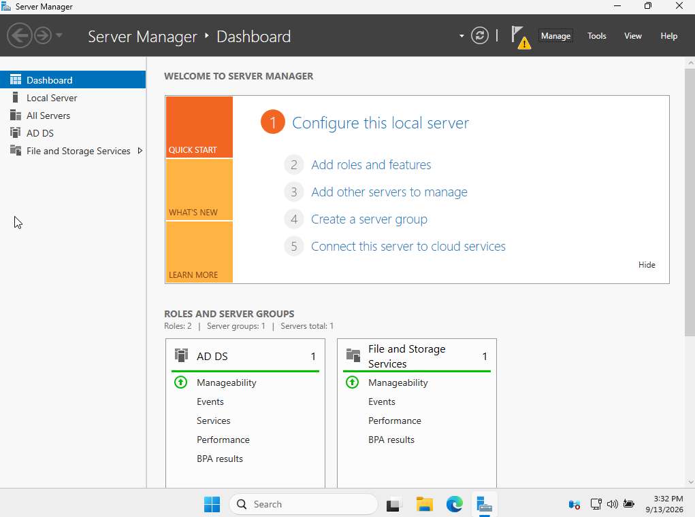

### 02 — AD DS Deployment Configuration
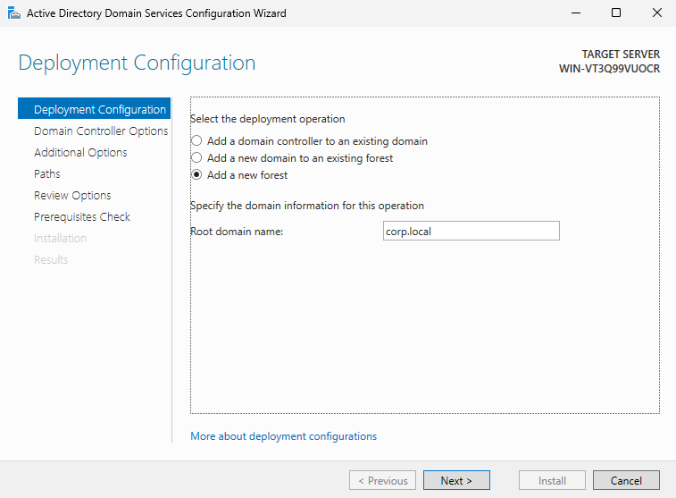

### 03 — Active Directory Forest
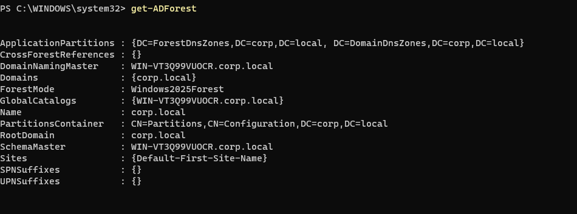

### 04 — Active Directory Domain
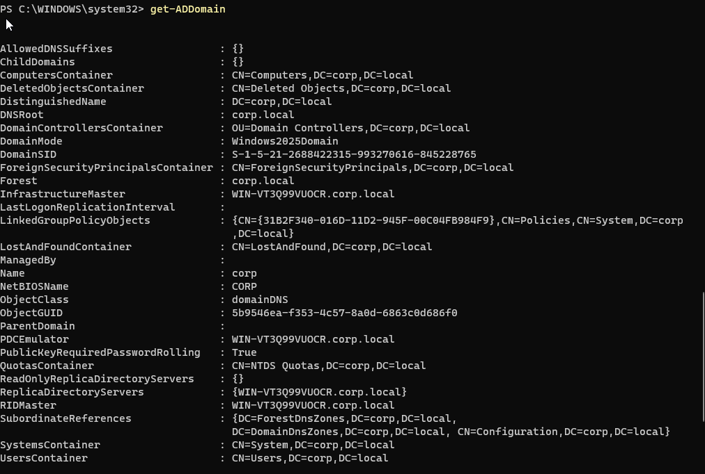

### 05 — Domain Controller Login
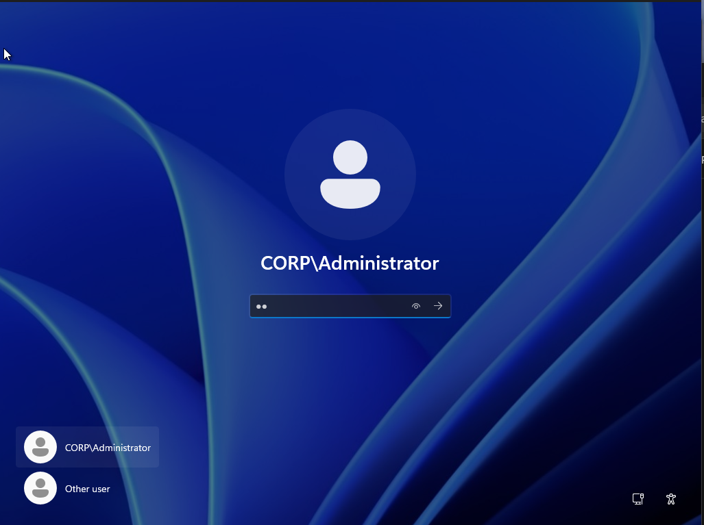

### 06 — Active Directory Users and Computers
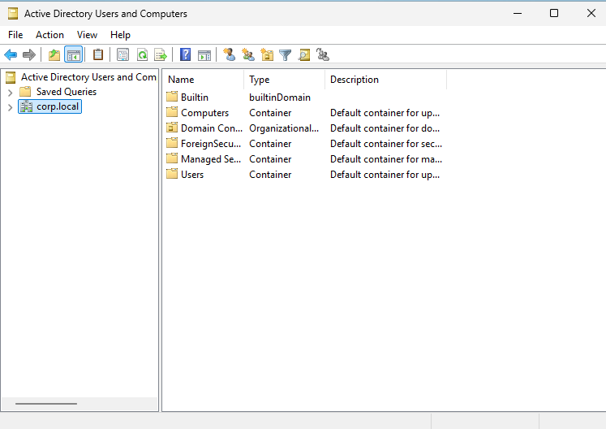

### 07 — Organizational Units
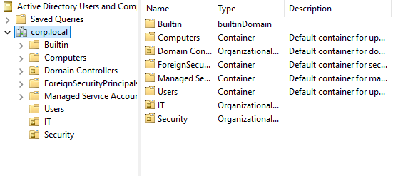

### 08 — Test User: John Smith
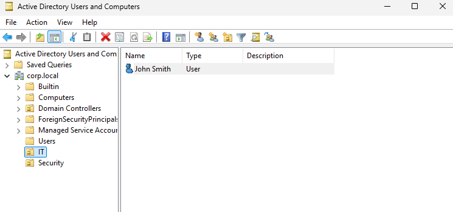

### 09 — SecurityTeam Group
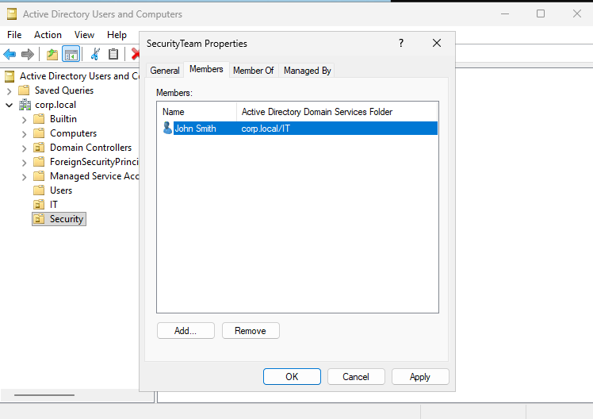

### 10 — Password Policy
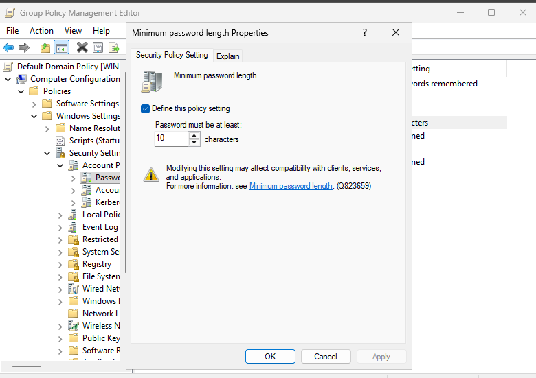

### 11 — Account Lockout Policy
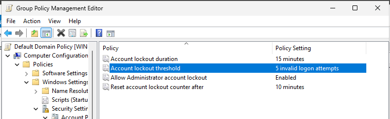

### 12 — Group Policy Update
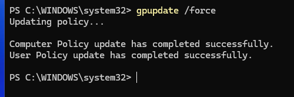

### 13 — SecurityShare and Group Access
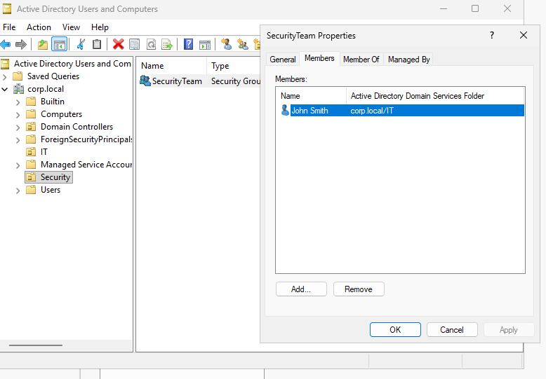

### 14 — File and Folder Permissions
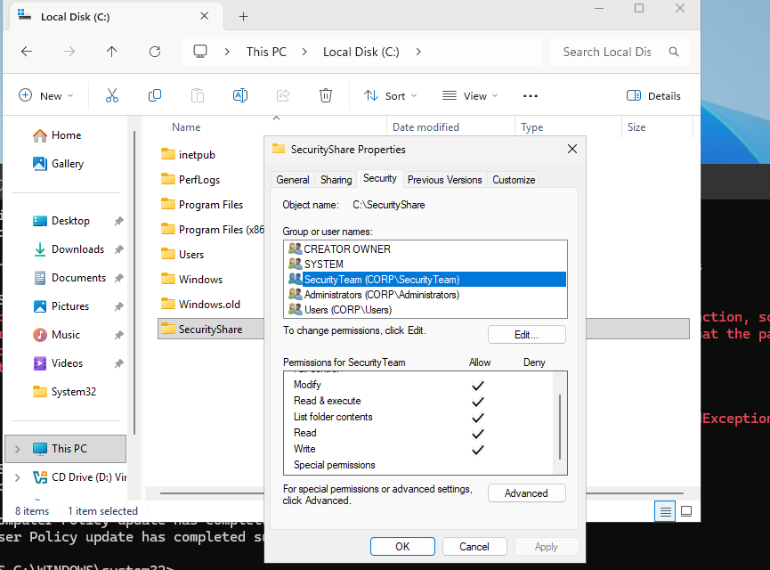

### 15 — Security Audit Logon Policy
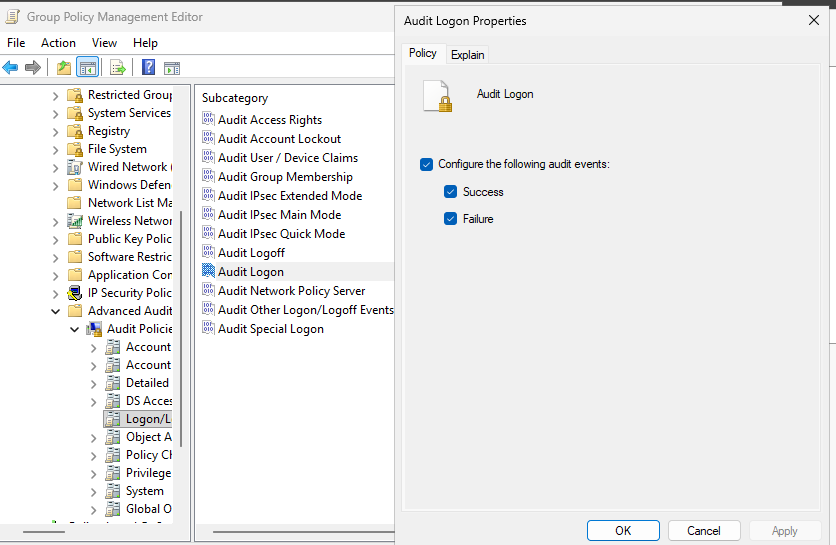

### 16 — GPUpdate After Auditing Configuration
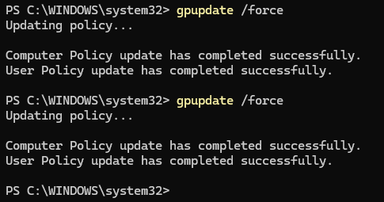

### 17 — Failed Login Test
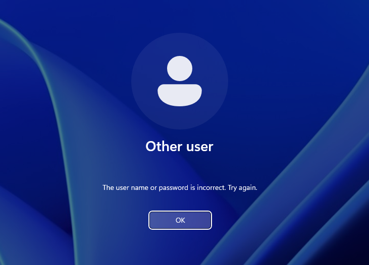

### 18 — Event ID 4625 Failed Login Events
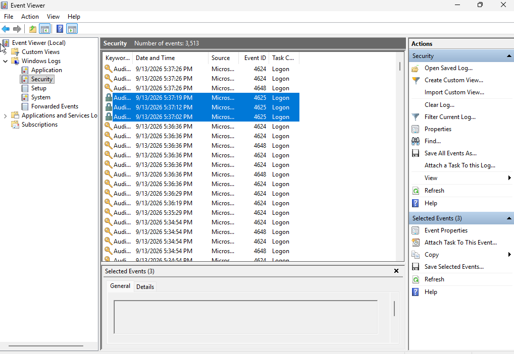

## Skills Demonstrated

- Active Directory administration
- Windows Server administration
- Identity and access management
- Group Policy
- Access control
- Windows security auditing
- Event log investigation
- PowerShell
